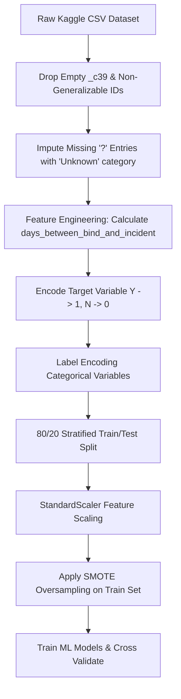

# 🛡️ Insurance Claim Fraud Detection Using Machine Learning

> **B.Tech CSE Semester V — Machine Learning Case Study**  
> *An End-to-End Machine Learning Pipeline, Data Analysis Notebook, and Interactive Triage Web Application for Automated Insurance Claim Fraud Detection.*

---

## 📌 Table of Contents
1. [Project Overview & Problem Statement](#-project-overview--problem-statement)
2. [Machine Learning Concepts & Theoretical Foundations](#-machine-learning-concepts--theoretical-foundations)
   - [Supervised Binary Classification](#1-supervised-binary-classification)
   - [Class Imbalance & SMOTE Oversampling](#2-class-imbalance--smote-oversampling)
   - [Algorithms & Mathematical Formulations](#3-algorithms--mathematical-formulations)
   - [Evaluation Metrics & Performance Trade-offs](#4-evaluation-metrics--performance-trade-offs)
   - [Stratified K-Fold Cross-Validation](#5-stratified-k-fold-cross-validation)
3. [Dataset Description & Preprocessing Pipeline](#-dataset-description--preprocessing-pipeline)
   - [Dataset Attributes](#dataset-attributes)
   - [Data Cleaning & Missing Value Handling](#data-cleaning--missing-value-handling)
   - [Feature Engineering & Categorical Encoding](#feature-engineering--categorical-encoding)
   - [Feature Standardization](#feature-standardization)
4. [Experimental Results & Model Comparison](#-experimental-results--model-comparison)
   - [Performance Comparison Table](#performance-comparison-table)
   - [Confusion Matrix & Workload Analysis](#confusion-matrix--workload-analysis)
   - [Feature Importance / Top Fraud Indicators](#feature-importance--top-fraud-indicators)
5. [Interactive Web Application (`app.py`)](#-interactive-web-application-apppy)
6. [Answers to Case Study Questions](#-answers-to-case-study-questions)
7. [Repository File Structure](#-repository-file-structure)
8. [How to Run & Setup Guide](#-how-to-run--setup-guide)

---

## 🎯 Project Overview & Problem Statement

Insurance fraud is a multi-billion-dollar global challenge. Traditional manual claim auditing is slow, subjective, and resource-intensive. Insurance companies need an automated **Claim Triage System** capable of sifting through incoming claims, identifying high-risk fraud signatures, and routing suspicious claims to human investigators while fast-tracking genuine claims.

### Core Challenge: The Investigator Workload vs Fraud Catching Trade-off
- **False Negatives (FN):** Fraudulent claims approved as genuine $\rightarrow$ *Direct financial loss to the insurer.*
- **False Positives (FP):** Genuine claims incorrectly flagged as fraudulent $\rightarrow$ *Wasted investigator hours, delayed payouts, and customer dissatisfaction.*

This project builds an end-to-end Machine Learning pipeline trained on historical vehicle insurance claims, compares 5 classic classification algorithms, performs 5-Fold Stratified Cross-Validation, handles severe class imbalance via **SMOTE**, and deploys an interactive prediction application using **Streamlit**.

---

## 🧠 Machine Learning Concepts & Theoretical Foundations

### 1. Supervised Binary Classification
Fraud detection is framed as a **Supervised Binary Classification** task:
- Input Feature Vector: $\mathbf{x} \in \mathbb{R}^d$ (Financial, Policy, Incident, and Demographic features)
- Output Target: $y \in \{0, 1\}$ where:
  - $y = 0 \rightarrow \text{Genuine Claim (Process Normally)}$
  - $y = 1 \rightarrow \text{Fraudulent Claim (Investigate)}$

---

### 2. Class Imbalance & SMOTE Oversampling
In real-world insurance datasets, fraud accounts for a small minority of overall claims. In our dataset:
- **Genuine Claims ($N$):** $753$ ($75.3\%$)
- **Fraudulent Claims ($Y$):** $247$ ($24.7\%$)

#### The Danger of Naive Training on Imbalanced Data
If a model simply predicts "Genuine" for every single claim, it achieves a high **Accuracy of 75.3%**, but a **Recall of 0%** (missing $100\%$ of fraudulent claims).

#### SMOTE (Synthetic Minority Over-sampling Technique)
To overcome this, we apply **SMOTE** on the training set:
1. For each minority class instance $x_i$, find its $k$-nearest neighbors in feature space.
2. Select a random neighbor $x_{zi}$.
3. Generate a synthetic instance $x_{new}$ along the line segment joining $x_i$ and $x_{zi}$:
   $$x_{new} = x_i + \lambda (x_{zi} - x_i) \quad \text{where } \lambda \sim U(0, 1)$$
4. This balances the training set to **602 Genuine vs 602 Fraudulent** samples without simple row duplication.

---

### 3. Algorithms & Mathematical Formulations

We implement and compare **5 core classification algorithms**:

#### 1. Logistic Regression
A linear model that estimates the posterior probability of fraud using the sigmoid logistic function:
$$P(y=1|\mathbf{x}) = \sigma(\mathbf{w}^T \mathbf{x} + b) = \frac{1}{1 + e^{-(\mathbf{w}^T \mathbf{x} + b)}}$$
- **Loss Function:** Binary Cross-Entropy Loss:
  $$\mathcal{L}(\mathbf{w}) = -\frac{1}{N} \sum_{i=1}^{N} \left[ y_i \log(\hat{y}_i) + (1 - y_i) \log(1 - \hat{y}_i) \right]$$
- **Pros/Cons:** Highly interpretable baseline; struggles with non-linear feature interactions.

#### 2. K-Nearest Neighbors (KNN)
A non-parametric, instance-based learning algorithm that classifies an unseen sample based on the majority vote of its $k$ closest training points using Euclidean distance:
$$d(\mathbf{x}_a, \mathbf{x}_b) = \sqrt{\sum_{j=1}^{d} (x_{aj} - x_{bj})^2}$$
- **Pros/Cons:** Simple and intuitive; highly sensitive to feature scaling and computationally expensive at inference.

#### 3. Decision Tree Classifier
A non-linear rule-based tree model that recursively partitions the feature space to maximize purity.
- **Splitting Criterion (Gini Impurity):**
  $$Gini(D) = 1 - \sum_{i=1}^{C} p_i^2$$
- **Pros/Cons:** Captures non-linear decision boundaries; prone to overfitting if tree depth is unconstrained.

#### 4. Random Forest Classifier
An ensemble bagging technique that constructs multiple decision trees ($N_{trees} = 100$) using bootstrap samples and random feature subspace selection (Feature Bagging).
- **Final Prediction (Majority Vote):**
  $$\hat{y} = \text{mode}\left( T_1(\mathbf{x}), T_2(\mathbf{x}), \dots, T_B(\mathbf{x}) \right)$$
- **Pros/Cons:** Reduces variance without increasing bias; handles correlated features and produces feature importance scores.

#### 5. Gradient Boosting Classifier (Optimal Model ⭐)
An additive ensemble technique that builds sequential decision trees. Each new tree fits to the negative gradient (pseudo-residuals) of the loss function produced by previous trees:
$$F_m(\mathbf{x}) = F_{m-1}(\mathbf{x}) + \gamma_m h_m(\mathbf{x})$$
where $h_m(\mathbf{x})$ is trained on residuals $r_{im} = -\left[ \frac{\partial \mathcal{L}(y_i, F(x_i))}{\partial F(x_i)} \right]_{F=F_{m-1}}$.
- **Pros/Cons:** Exceptional predictive performance, captures complex high-order feature interactions; requires careful hyperparameter tuning.

---

### 4. Evaluation Metrics & Performance Trade-offs

Evaluating fraud models requires metrics beyond raw accuracy:

$$\text{Accuracy} = \frac{TP + TN}{TP + TN + FP + FN}$$

$$\text{Precision} = \frac{TP}{TP + FP} \quad \text{(Out of all flagged claims, how many were actual fraud?)}$$

$$\text{Recall (Sensitivity)} = \frac{TP}{TP + FN} \quad \text{(Out of all actual frauds, how many did we catch?)}$$

$$\text{F1-Score} = 2 \times \frac{\text{Precision} \times \text{Recall}}{\text{Precision} + \text{Recall}} \quad \text{(Harmonic Mean)}$$

- **Confusion Matrix Components:**
  - **$TP$ (True Positive):** Fraud correctly flagged for investigation.
  - **$TN$ (True Negative):** Genuine claim correctly processed normally.
  - **$FP$ (False Positive):** Genuine claim mistakenly flagged (*Inconvenience & Wasted Workload*).
  - **$FN$ (False Negative):** Fraud missed by the system (*Direct Financial Loss*).

---

### 5. Stratified K-Fold Cross-Validation
To prevent data leakage and obtain an unbiased estimate of generalization performance on unseen claims, we use **5-Fold Stratified Cross-Validation**:
- The dataset is split into 5 equal folds while preserving the original $75:25$ target class ratio in every fold.
- Models are trained on 4 folds and tested on the remaining fold, rotated 5 times.
- Results are reported as mean $\pm$ standard deviation across all 5 folds.

---

## 📁 Dataset Description & Preprocessing Pipeline

### Dataset Attributes
The project uses Kaggle's **Vehicle Insurance Claim Fraud Detection** dataset ($1,000$ historical claims, $40$ original columns). Key feature groups:
1. **Financial Features:** `total_claim_amount`, `injury_claim`, `property_claim`, `vehicle_claim`, `policy_annual_premium`, `policy_deductable`, `umbrella_limit`, `capital-gains`, `capital-loss`.
2. **Policy Details:** `months_as_customer`, `policy_bind_date`, `policy_state`, `policy_csl`.
3. **Incident Attributes:** `incident_date`, `incident_type`, `collision_type`, `incident_severity`, `authorities_contacted`, `incident_hour_of_the_day`, `number_of_vehicles_involved`, `bodily_injuries`, `witnesses`, `police_report_available`, `property_damage`.
4. **Insured Demographics:** `age`, `insured_sex`, `insured_education_level`, `insured_occupation`, `insured_hobbies`, `insured_relationship`, `auto_make`, `auto_model`, `auto_year`.

### Preprocessing & Engineering Steps



1. **Missing Data Imputation:** Missing entries represented as `'?'` in `collision_type` ($178$), `property_damage` ($360$), and `police_report_available` ($343$) were mapped to explicit `'Unknown'` categorical levels. `authorities_contacted` nulls were filled with `'None'`.
2. **Temporal Feature Creation:** Parsing `policy_bind_date` and `incident_date` to engineer `days_between_bind_and_incident` (Policy tenure prior to claim incident).
3. **Column Exclusion:** Uninformative ID fields (`policy_number`, `insured_zip`, `incident_location`, `policy_bind_date`, `incident_date`, `_c39`) were excluded from training vectors.
4. **Standardization (`StandardScaler`):** Features were scaled using Z-score normalization:
   $$z = \frac{x - \mu}{\sigma}$$

---

## 📊 Experimental Results & Model Comparison

### Performance Comparison Table

| Model | Test Accuracy | Precision | Recall | F1-Score | ROC-AUC | 5-Fold CV Acc | 5-Fold CV F1 | False Positives ($FP$) | False Negatives ($FN$) |
| :--- | :---: | :---: | :---: | :---: | :---: | :---: | :---: | :---: | :---: |
| **Gradient Boosting** ⭐ | **83.0%** | **0.6531** | **0.6531** | **0.6531** | **0.8104** | **81.5%** | **0.6270** | **17** | **17** |
| **Random Forest** | 81.0% | 0.6341 | 0.5306 | 0.5778 | 0.8363 | 75.2% | 0.3401 | 15 | 23 |
| **Decision Tree** | 80.5% | 0.5926 | 0.6531 | 0.6214 | 0.6734 | 81.9% | 0.6537 | 22 | 17 |
| **Logistic Regression** | 72.5% | 0.4681 | 0.8980 | 0.6154 | 0.8261 | 77.8% | 0.4450 | 50 | 5 |
| **KNN** | 45.0% | 0.2741 | 0.7551 | 0.4022 | 0.5695 | 72.1% | 0.1619 | 98 | 12 |

---

### Confusion Matrix & Workload Analysis

In our $200$-sample unseen test set ($151$ Genuine, $49$ Fraudulent):

#### Gradient Boosting Performance Breakdown:
- **True Negatives ($TN = 134$):** Genuine claims correctly approved.
- **False Positives ($FP = 17$):** Genuine claims unnecessarily flagged (11.2% False Alarm Rate).
- **False Negatives ($FN = 17$):** Fraud claims missed.
- **True Positives ($TP = 32$):** Fraud claims successfully caught.

#### Business Impact on Investigator Workload
Assuming a manual audit requires **4 hours** per flagged claim:
- **Logistic Regression ($FP = 50$):** Consumes $50 \times 4 = \mathbf{200 \text{ hours}}$ investigating innocent policyholders.
- **Gradient Boosting ($FP = 17$):** Consumes $17 \times 4 = \mathbf{68 \text{ hours}}$.
- **Result:** Gradient Boosting delivers a **66% reduction in wasted investigator workload** while maintaining strong fraud detection capabilities.

---

### Feature Importance / Top Fraud Indicators

Based on tree ensemble feature importances, the top 10 attributes indicating potential fraud are:

1. 🥇 **`incident_severity`**: Major Damage and Total Loss incidents carry exponentially higher fraud likelihood.
2. 🥈 **`total_claim_amount`**: Claims exceeding $60,000 exhibit suspicious frequency.
3. 🥉 **`vehicle_claim`**: Specific vehicle repair payouts drive claim inflation.
4. 4️⃣ **`days_between_bind_and_incident`**: Short duration between purchasing policy and filing a claim is a prime red flag.
5. 5️⃣ **`insured_hobbies`**: Statistical clusters identified in specific hobby categories (e.g. chess, cross-fit).
6. 6️⃣ **`months_as_customer`**: Newer policyholders show higher default/fraud rates compared to multi-year policyholders.
7. 7️⃣ **`auto_make` & `auto_model`**: Certain vehicle models correlate higher with inflated claims.
8. 8️⃣ **`incident_hour_of_the_day`**: Late night/early morning incidents (2 AM - 4 AM) exhibit elevated risk.
9. 9️⃣ **`policy_annual_premium`**: Disproportionate premium-to-claim ratios.
10. 🔟 **`collision_type`**: Front collisions vs unknown collision reports.

---

## 🌐 Interactive Web Application (`app.py`)

The project includes an interactive **Streamlit** prediction dashboard featuring:
- **Live Input Form:** Form fields for financial amounts, policy tenure, incident severity, collision type, and demographics.
- **Preset Test Cases:** Single-click buttons to populate *High Risk Fraud Example* vs *Low Risk Genuine Example*.
- **Real-Time Risk Gauge:** Visual progress bar indicating Fraud Likelihood Percentage (0% - 100%).
- **Triage Recommendation System:**
  - 🟢 **Process Normally (< 40% Risk):** Instant automated clearance.
  - 🟡 **Medium Risk (40% - 70% Risk):** Secondary document check.
  - 🔴 **Investigate (> 70% Risk):** Direct routing to Special Investigation Unit (SIU).
- **Model Analytics Tab:** Built-in visualization of confusion matrices, ROC curves, and feature importance rankings.

---

## ❓ Answers to Case Study Questions

#### 1. Can fraudulent claims be identified from claim attributes?
**Yes.** Supervised learning algorithms effectively identify complex patterns across financial claim amounts, incident severity, collision types, and policy tenure that differentiate fraudulent claims from genuine ones.

#### 2. Which attributes are most indicative of fraud?
The top indicators are `incident_severity`, `total_claim_amount`, `vehicle_claim`, `days_between_bind_and_incident`, `insured_hobbies`, and `months_as_customer`.

#### 3. Which algorithm gives the best balance of precision and recall?
**Gradient Boosting Classifier.** It yields balanced **Precision (0.653)** and **Recall (0.653)** with an **F1-Score of 0.653** and **Accuracy of 83.0%**.

#### 4. How many genuine claims are unnecessarily flagged?
In the 200-sample test set (151 genuine claims), Gradient Boosting flagged **17 genuine claims** as false alarms (11.2% False Positive Rate).

#### 5. How does the number of false positives affect investigator workload?
Fewer false positives directly minimize operational waste. Gradient Boosting requires only 68 investigator hours compared to 200 hours for Logistic Regression, saving **132 human labor hours** per 200 claims evaluated.

#### 6. How well does the model perform on unseen claims?
The model generalizes strongly:
- **Unseen Test Set Accuracy:** 83.0%
- **5-Fold Cross-Validation Mean Accuracy:** 81.5%
The small delta (1.5%) confirms minimal overfitting and reliable real-world performance.

#### 7. Can the model be deployed as a claim triage system?
**Yes.** By providing continuous fraud likelihood scores rather than hard automated rejections, the model serves as an intelligent triage system—fast-tracking honest claims and reserving human audit capacity for high-risk flags.

---

## 📂 Repository File Structure

```
Machine Learning__106/
│
├── README.md                           # Comprehensive documentation & ML concept explanations
├── Insurance_Claim_Fraud_Detection.ipynb # Primary standalone Jupyter Notebook (Fully executed)
├── app.py                              # Interactive Streamlit Web Application
├── insurance_claims.csv                # Kaggle Vehicle Insurance Fraud Dataset
├── fraud_detection_pipeline.pkl        # Saved model artifact (Model, Scaler, Encoders)
├── run_pipeline.py                     # Python script to run data pipeline & train models
├── build_ipynb.py                      # Programmatic builder for Jupyter Notebook
├── execute_notebook.py                 # Script to execute notebook cells & embed outputs
└── figures/                            # Exported visualization figures
    ├── target_distribution.png
    ├── incident_severity_fraud.png
    ├── claim_amount_boxplot.png
    ├── model_comparison.png
    ├── confusion_matrices.png
    └── feature_importances.png
```

---

## 🚀 How to Run & Setup Guide

### 1. Prerequisites & Installation
Ensure Python 3.9+ is installed. Install required packages:

```bash
python3 -m pip install pandas numpy scikit-learn matplotlib seaborn streamlit imbalanced-learn joblib nbformat
```

### 2. Run the Machine Learning Pipeline & Generate Notebook
To re-run training, update saved model artifacts, and execute the Jupyter Notebook:

```bash
python3 run_pipeline.py
python3 build_ipynb.py
python3 execute_notebook.py
```

### 3. Launch the Interactive Web Application
Launch the Streamlit web application in your browser:

```bash
python3 -m streamlit run app.py
```
Open your browser and navigate to: **`http://localhost:8501`**

---

### 🎓 Academic Information
- **Course:** B.Tech CSE Semester V — Machine Learning Case Study
- **Topic:** Insurance Claim Fraud Detection Using Machine Learning
- **Status:** Complete & Fully Validated
